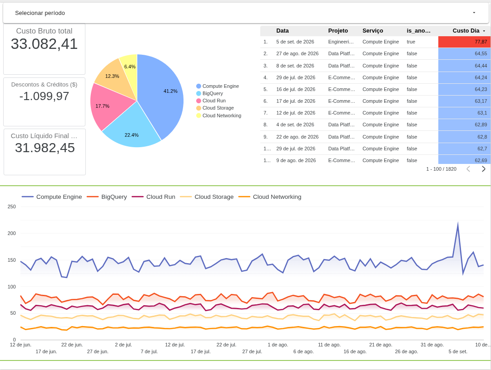
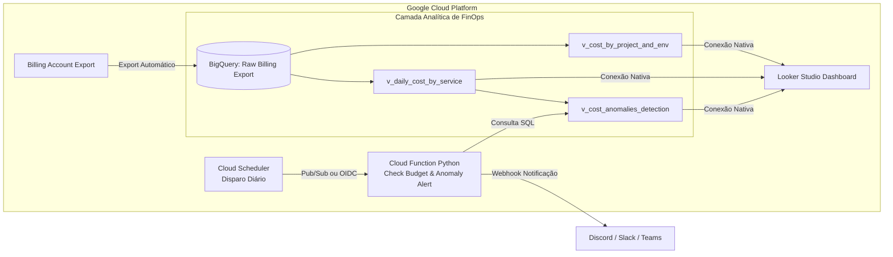

# ☁️ GCP FinOps — Dashboard & Automação de Alertas de Orçamento

[](https://cloud.google.com/)
[](https://www.terraform.io/)
[](https://cloud.google.com/bigquery)
[](https://www.python.org/)
[](https://lookerstudio.google.com/)

> Plataforma completa de **FinOps (Financial Operations)** para governança de custos no Google Cloud Platform (GCP). Inclui ingestão de faturamento detalhado no BigQuery, modelagem analítica com cálculo de custo líquido, detecção estatística de anomalias via Window Functions, alertas serverless em tempo real (Discord/Slack) e dashboard executivo interativo no Looker Studio provisionado 100% via Terraform.

---

## 📸 Painel Executivo (Looker Studio)

<!-- Adicione o screenshot do dashboard na pasta docs/dashboard.png -->


### Componentes Principais do Dashboard:
1. **Scorecards de KPIs Financeiros:**
   - **Custo Bruto (*Gross Cost*):** Valor integral de consumo sem abatimentos.
   - **Créditos & Descontos Aplicados:** Economia obtida com programas, CUDs (*Committed Use Discounts*), SUDs (*Sustained Use Discounts*) e promoções.
   - **Custo Líquido Final (*Net Cost*):** Fatura real a pagar ($\text{Líquido} = \text{Bruto} - \text{Descontos}$).
2. **Distribuição Percentual por Projeto (Showback / Chargeback):**
   - Gráfico de Donut/Pizza permitindo rastrear o consumo relativo entre squads e ambientes.
3. **Tendência Histórica de Consumo por Serviço:**
   - Série temporal que evidencia sazonalidade e crescimento de serviços críticos (Compute Engine, BigQuery, Cloud Storage, Cloud Run, Networking).
4. **Detecção de Desvios & Anomalias:**
   - Tabela analítica com identificação automática de ruídos financeiros e picos fora do padrão histórico, destacando aumentos repentinos de custos com formatação condicional.

---

## 🎯 O Problema Real de Negócio

Empresas que escalam suas operações na nuvem frequentemente sofrem com a falta de visibilidade sobre seus gastos:
- **Desperdício Invisível:** Recursos subutilizados ou esquecidos em ambientes de desenvolvimento e homologação.
- **Falta de Showback:** Dificuldade de atribuir com precisão a fatura da nuvem aos centros de custo e squads responsáveis.
- **Surpresas no Fim do Mês:** Identificação de picos de gasto tardiamente, apenas após o fechamento da fatura contábil.

Este projeto estabelece um framework prático de FinOps focado nos 3 pilares da FinOps Foundation: **Informar (Visibilidade)**, **Otimizar (Detecção de Desperdícios)** e **Operar (Alertas Proativos)**.

---

## 🏗️ Arquitetura da Solução



---

## 🧠 Detecção Estatística de Anomalias (SQL Window Functions)

Em vez de usar limites fixos e estáticos (que geram alertas falsos devido ao crescimento natural da infraestrutura), a view `sql/v_cost_anomalies_detection.sql` implementa **Média Móvel dos últimos 7 dias (Moving Average)** particionada por serviço e projeto:

$$\text{Média Móvel (7d)} = \text{AVG}(NetCost) \text{ OVER } (\text{PARTITION BY } project, service \text{ ROWS BETWEEN 7 PRECEDING AND 1 PRECEDING})$$

### Regra do Gatilho de Anomalia (`is_anomaly`):
Uma ocorrência é classificada como anomalia quando atende **simultaneamente** a dois critérios:
1. **Variação Relativa:** O custo do dia ultrapassou em **100% ou mais** a média dos 7 dias anteriores.
2. **Impacto Financeiro Mínimo:** O desvio absoluto foi superior a **$20,00** (evitando falsos positivos em serviços de baixo consumo em centavos).

---

## 🛠️ Stack Tecnológica & Justificativas

| Camada | Tecnologia | Justificativa Técnica |
| :--- | :--- | :--- |
| **Data Warehouse** | **BigQuery** | Escalabilidade sob demanda, queries SQL padrão, particionamento diário nativo e custo zero de infraestrutura ociosa. |
| **Modelagem de Dados** | **BigQuery Views** | Transformação em tempo real sem duplicação de dados e garantia de versão única da verdade para consumo no BI. |
| **Visualização** | **Looker Studio** | Conector nativo de alto desempenho com o BigQuery, filtros cruzados interativos e compartilhamento executivo sem custo de licença. |
| **Serverless & Alertas** | **Cloud Functions (Python)** | Execução sob demanda (*event-driven*), isolamento por Service Account e integração com Webhooks. |
| **Orquestração** | **Cloud Scheduler** | Gerenciador cron nativo, seguro e de alta disponibilidade. |
| **Infraestrutura como Código** | **Terraform** | Reprodutibilidade total, isolamento por variáveis (`.tfvars`) e controle rigoroso de privilégios IAM mínimos. |

---

## 📂 Estrutura do Projeto

```text
gcp-finops-dashboard/
├── docs/                                # Documentação e imagens do painel
│   └── dashboard.png                    # Screenshot do Looker Studio
├── functions/
│   └── check_budget/                    # Cloud Function de verificação de orçamento
│       ├── main.py                      # Lógica Python de consulta e webhook
│       └── requirements.txt             # Dependências (google-cloud-bigquery, requests)
├── scripts/
│   ├── generate_billing_data.py         # Gerador de dados sintéticos de faturamento
│   └── dados_billing_simulados.jsonl    # Massa de dados de simulação (90 dias de histórico)
├── sql/
│   ├── v_daily_cost_by_service.sql      # Custo líquido diário, créditos e custos brutos
│   ├── v_cost_by_project_and_env.sql    # Governança de centros de custo e ambientes
│   └── v_cost_anomalies_detection.sql   # Inteligência analítica de desvios e picos
├── terraform/                           # Provisionamento automatizado de toda a infraestrutura
│   ├── bigquery.tf                      # Dataset, tabela raw particionada e views analíticas
│   ├── cloud_function.tf                # Deploy da Cloud Function e bucket de artefato
│   ├── iam.tf                           # Service Accounts com princípio do menor privilégio
│   ├── services.tf                      # APIs habilitadas no GCP
│   ├── variables.tf                     # Declaração de variáveis parametrizadas
│   ├── terraform.tfvars.example         # Exemplo seguro de variáveis
│   └── outputs.tf                       # Saídas do provisionamento
└── README.md
```

---

## 🚀 Como Reproduzir o Projeto

### Pré-requisitos:
- [Google Cloud SDK (`gcloud`)](https://cloud.google.com/sdk/docs/install) autenticado.
- [Terraform](https://learn.hashicorp.com/tutorials/terraform/install-cli) (>= 1.5.0).
- Python 3.11+.

### 1. Configurar o Terraform e Variáveis
```bash
cd terraform
cp terraform.tfvars.example terraform.tfvars
```
Edite o `terraform.tfvars` com o ID do seu projeto GCP e a URL do Webhook (Discord ou Slack):
```hcl
project_id          = "seu-projeto-gcp"
region              = "us-central1"
dataset_id          = "billing_finops"
dataset_location    = "US"
discord_webhook_url = "https://discord.com/api/webhooks/..."
```

### 2. Provisionar a Infraestrutura
```bash
terraform init
terraform plan
terraform apply
```

### 3. Carga dos Dados de Faturamento (Sintéticos ou Export Real)
```bash
# Gerar 90 dias de histórico simulando uso real e anomalias
python3 scripts/generate_billing_data.py

# Carregar os dados gerados na tabela particionada do BigQuery
bq load \
  --source_format=NEWLINE_DELIMITED_JSON \
  billing_finops.gcp_billing_export_resource_v1_01ABCD_2345EF_6789GH \
  scripts/dados_billing_simulados.jsonl
```

### 4. Conectar no Looker Studio
1. Acesse o [Looker Studio](https://lookerstudio.google.com/).
2. Adicione os dados conectando nas views do BigQuery (`v_daily_cost_by_service` e `v_cost_anomalies_detection`).
3. Monte os componentes (Scorecards, Gráfico de Donut, Gráfico de Linha e Tabela de Anomalias).

---

## 📈 Resultados e Habilidades Demonstradas
- **Modelagem Analítica de FinOps:** Compreensão profunda da hierarquia e taxonomia do faturamento GCP (Bruto vs Líquido vs Créditos).
- **SQL Avançado no BigQuery:** Window Functions estatísticas, agregação temporal e manipulação de tipos complexos (`REPEATED RECORD` com `UNNEST`).
- **Engenharia Serverless:** Cloud Functions event-driven integradas a webhooks de mensageria corporativa.
- **Infraestrutura como Código (IaC):** Pipeline 100% automatizado, declarativo e auditável com Terraform.
- **Storytelling com Dados:** Tradução de telemetria técnica de infraestrutura em métricas financeiras de negócio acionáveis.

---

## 📄 Licença
Distribuído sob a licença MIT.
