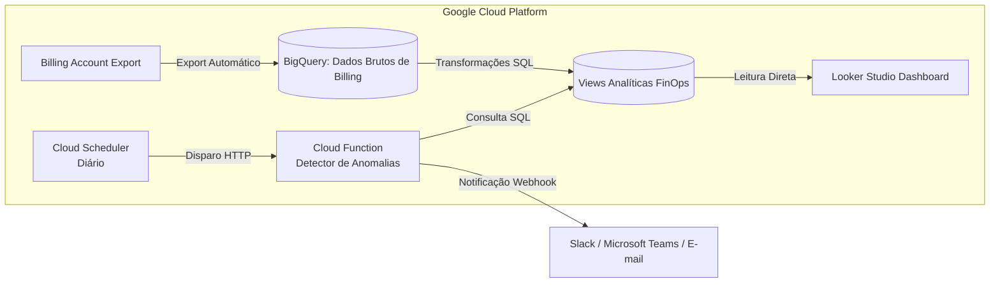

# ☁️ GCP FinOps — Dashboard & Automação de Alertas de Orçamento

[](https://cloud.google.com/)
[](https://www.terraform.io/)
[](https://cloud.google.com/bigquery)
[](https://www.python.org/)
[](https://lookerstudio.google.com/)

> Projeto prático de **FinOps (Financial Operations)** para visualização centralizada de custos em nuvem, modelagem analítica no BigQuery, detecção de anomalias financeiras e provisionamento 100% automatizado com Terraform.

---

## 🎯 O Problema Real de Negócio

Empresas que migram ou operam no **Google Cloud Platform (GCP)** frequentemente enfrentam dificuldades para responder perguntas básicas como:
- *“Qual serviço ou equipe teve o maior aumento de custo neste mês?”*
- *“Existem recursos ociosos ou ambientes de desenvolvimento gerando custos desnecessários?”*
- *“Como saber se vamos estourar o orçamento antes que a fatura do fim do mês chegue?”*

A falta de governança financeira em nuvem leva a desperdícios recorrentes. Este projeto resolve esse gargalo entregando **visibilidade em tempo real**, **modelagem dimensional de custos** e **alarmes preventivos proativos**.

---

## 🏗️ Arquitetura da Solução



---

## 🛠️ Stack Tecnológica & Justificativas Técnicas

| Componente | Ferramenta | Decisão Arquitetural |
| :--- | :--- | :--- |
| **Data Warehouse** | **BigQuery** | Padrão nativo para faturamento do GCP, escalabilidade sob demanda e custo zero para bases pequenas com particionamento inteligente. |
| **Modelagem de Dados** | **SQL (BigQuery Views)** | Centralização da regra de negócio de custos em views lógicas (sem duplicação desnecessária de armazenamento). |
| **Visualização** | **Looker Studio** | Conector nativo de alta performance para BigQuery, sem custos adicionais de licença e compartilhamento simplificado para executivos. |
| **Automação & Alertas** | **Cloud Functions (Python)** | Arquitetura *Serverless event-driven* executada sob demanda, garantindo custo operacional praticamente nulo. |
| **Orquestração** | **Cloud Scheduler** | Cron job gerenciado para disparo periódico dos pipelines de verificação de anomalias. |
| **Infraestrutura como Código** | **Terraform** | Reprodutibilidade total do ambiente, controle de versão da infraestrutura e princípio do menor privilégio em IAM. |

---

## 📂 Estrutura do Repositório

```text
gcp-finops-dashboard/
├── docs/                       # Diagramas de arquitetura e documentação
├── functions/                  # Código serverless de monitoramento e alertas
│   └── check_budget/           # Cloud Function em Python
├── scripts/                    # Utilitários e gerador de dados sintéticos de billing
├── sql/                        # Views analíticas e queries de detecção de anomalias
└── terraform/                  # Manifestos de infraestrutura como código (IaC)
```

---

## 🚀 Próximos Passos do Desenvolvimento

- [x] Estruturação do repositório e baseline de arquitetura
- [ ] Construção do gerador de dados sintéticos compatível com GCP Billing Export
- [ ] Modelagem das views SQL de agregação e KPIs FinOps
- [ ] Provisionamento da infraestrutura com Terraform (BigQuery, IAM, Cloud Functions)
- [ ] Criação do dashboard executivo no Looker Studio
- [ ] Implementação do bot de alertas no Slack
